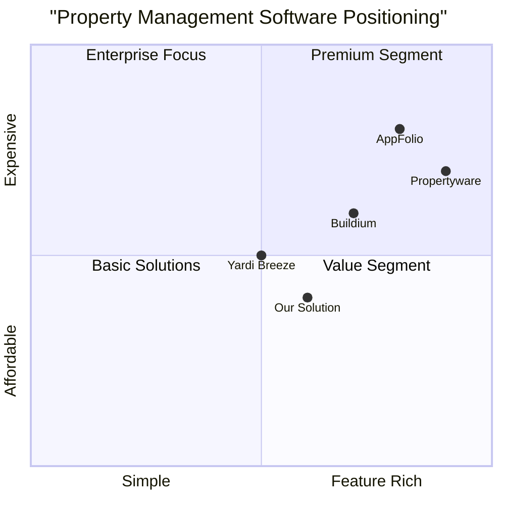

# Property Management SaaS Platform PRD

## 1. Project Information

### 1.1 Overview
A comprehensive SaaS platform for property management, designed to streamline interactions between landlords and tenants while providing robust property management tools.

### 1.2 Technical Stack
- Backend: Laravel Framework
- Database: MySQL
- Frontend: React.js with Tailwind CSS

### 1.3 Original Requirements
Create a SaaS web application for landlords and tenants to manage properties, track rent collection, and handle maintenance requests. The system should support multiple user roles, online payments, document management, and a property-specific chat system.

## 2. Product Definition

### 2.1 Product Goals
1. Streamline property management operations by providing an all-in-one platform for landlords to manage multiple properties efficiently
2. Simplify the rent collection process through secure online payments and automated receipt generation
3. Enhance communication and maintenance management between landlords and tenants through integrated chat and request tracking systems

### 2.2 User Stories

**As a Landlord:**
- I want to manage multiple properties in a single dashboard so that I can efficiently oversee my entire portfolio
- I want to track rent payments and generate reports so that I can maintain accurate financial records
- I want to receive and manage maintenance requests so that I can promptly address tenant issues

**As a Tenant:**
- I want to pay rent online and receive instant receipts so that I can maintain proper payment records
- I want to submit maintenance requests with photos so that I can clearly communicate issues
- I want to communicate directly with my landlord so that I can quickly resolve property-related concerns

**As a Superuser:**
- I want to oversee all properties and users so that I can maintain platform quality
- I want to manage landlord accounts so that I can ensure proper platform usage
- I want to access system-wide analytics so that I can monitor platform performance

### 2.3 Competitive Analysis

#### Market Leaders Analysis:

1. **Buildium**
- Pros:
  * Comprehensive accounting tools
  * User-friendly interface
  * Strong resident portal
- Cons:
  * Limited customization options
  * Higher cost for small portfolios
  * Basic reporting features

2. **AppFolio**
- Pros:
  * Advanced automation features
  * Robust accounting system
  * Excellent customer support
- Cons:
  * Higher minimum monthly fee
  * Steep learning curve
  * Limited flexibility for small portfolios

3. **Propertyware**
- Pros:
  * Highly customizable
  * Detailed reporting
  * Strong maintenance tracking
- Cons:
  * Complex interface
  * Minimum portfolio size requirement
  * Higher cost

4. **Yardi Breeze**
- Pros:
  * Modern interface
  * Good mobile functionality
  * Integrated marketing tools
- Cons:
  * Limited advanced features
  * Basic accounting capabilities
  * Restricted customization

5. **Our Solution**
- Pros:
  * Intuitive chat system
  * Flexible pricing model
  * Custom-built for Laravel ecosystem
- Cons:
  * New market entrant
  * Limited initial features
  * No established user base

### 2.4 Competitive Positioning Chart




## 3. Technical Specifications

### 3.1 Requirements Analysis

#### Authentication & Authorization
- Multi-role user system (Superuser, Landlord, Tenant)
- Secure login with email verification
- Password recovery system
- Role-based access control
- Session management

#### Property Management Module
- Property creation and editing
- Unit/apartment management
- Property details and documentation
- Property status tracking
- Image and document storage

#### Financial Management
- Online payment processing
- Automated rent collection
- Payment tracking and receipts
- Financial reporting
- Transaction history

#### Maintenance Management
- Request submission system
- Status tracking
- Photo/document attachments
- Maintenance history
- Service provider management

#### Communication System
- Property-specific chat
- Real-time messaging
- Notification system
- Message history

#### Document Management
- Secure document storage
- Document sharing
- Version control
- Access permissions

### 3.2 Requirements Pool

#### P0 (Must Have)
1. User Management
   - User registration and authentication
   - Role-based access control
   - User profile management

2. Property Management
   - Property creation and editing
   - Unit management
   - Tenant assignment
   - Property details and photos

3. Financial Operations
   - Online rent payment
   - Payment tracking
   - Receipt generation
   - Basic financial reporting

4. Communication
   - Basic chat functionality
   - Notification system
   - Maintenance request submission

#### P1 (Should Have)
1. Enhanced Property Management
   - Property analytics
   - Occupancy tracking
   - Lease management
   - Document templates

2. Advanced Financial Features
   - Late fee calculation
   - Payment reminders
   - Financial forecasting
   - Advanced reporting

3. Maintenance Management
   - Scheduled maintenance
   - Service provider directory
   - Maintenance cost tracking
   - Work order management

#### P2 (Nice to Have)
1. Advanced Features
   - Mobile app
   - API integration
   - Virtual tours
   - Smart home integration

2. Additional Tools
   - Market analysis tools
   - Tenant screening
   - Insurance management
   - Property valuation

### 3.3 UI Design Draft

#### Dashboard Layouts

1. Superuser Dashboard
```
+----------------+------------------+
|   Navigation   |    Overview      |
+----------------+                  |
| - Properties   |  - Total Props   |
| - Landlords    |  - Active Users  |
| - Tenants      |  - Revenue      |
| - Reports      |                  |
+----------------+------------------+
|        Detailed Analytics         |
+----------------------------------+
|     Property/User Management      |
+----------------------------------+
```

2. Landlord Dashboard
```
+----------------+------------------+
|   Navigation   |   Properties     |
+----------------+                  |
| - Properties   |  - Status        |
| - Tenants      |  - Rent Status   |
| - Maintenance  |  - Requests      |
| - Reports      |                  |
+----------------+------------------+
|        Property Details           |
+----------------------------------+
|     Maintenance & Messages        |
+----------------------------------+
```

3. Tenant Dashboard
```
+----------------+------------------+
|   Navigation   |   Rent Status    |
+----------------+                  |
| - Payments     |  - Due Date      |
| - Maintenance  |  - Amount        |
| - Documents    |  - History       |
| - Messages     |                  |
+----------------+------------------+
|     Maintenance Requests          |
+----------------------------------+
|        Messages & Notices         |
+----------------------------------+
```

### 3.4 Open Questions

1. Technical Considerations
   - What is the expected scale of the system in terms of users and properties?
   - Are there specific performance requirements for real-time features?
   - What are the data retention policies for messages and documents?

2. Business Rules
   - How should the system handle multiple property types?
   - What are the specific requirements for financial reporting?
   - How should the system manage different payment methods?

3. Security Concerns
   - What level of encryption is required for sensitive data?
   - How should we handle data backup and recovery?
   - What are the specific compliance requirements for different regions?

4. Integration Requirements
   - Which payment gateways should be supported?
   - Are there existing systems that need integration?
   - What external services need to be connected?

## 4. Implementation Timeline

### Phase 1 (Months 1-2)
- Basic user authentication
- Property management core features
- Simple rent tracking

### Phase 2 (Months 3-4)
- Online payment integration
- Maintenance request system
- Basic chat functionality

### Phase 3 (Months 5-6)
- Advanced reporting
- Document management
- Enhanced communication features

## 5. Success Metrics

### Key Performance Indicators (KPIs)
1. User Engagement
   - Monthly Active Users (MAU)
   - Average session duration
   - Feature usage rates

2. Financial Metrics
   - Payment processing volume
   - On-time payment rate
   - Revenue per property

3. Operational Metrics
   - Maintenance request resolution time
   - Chat response time
   - Document processing time

4. System Performance
   - System uptime
   - Page load times
   - API response times
